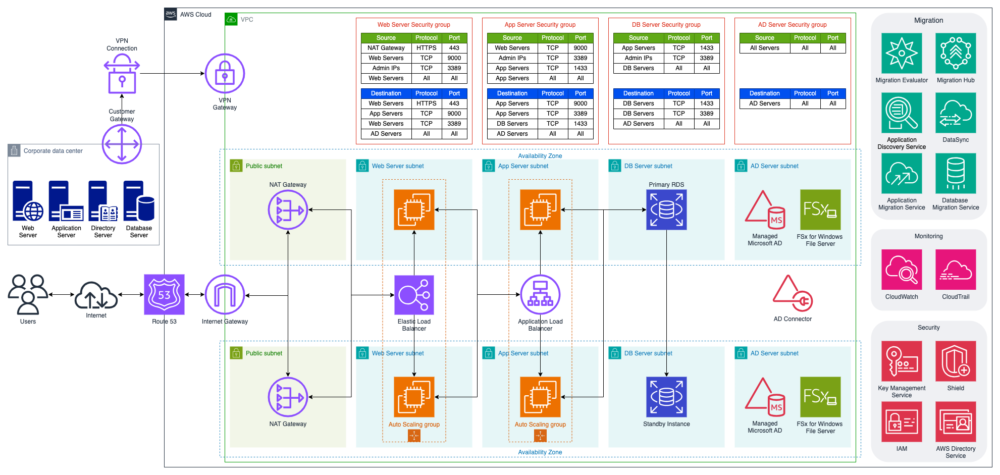

# FishTank Ltd Cloud Migration Plan

- Prepared for: FishTank Ltd
- Prepared by: Armstrong Cloud Migration Services Ltd
- Date: 16th May 2024

Dear Ryan Pothecary,

Thank you for considering Armstrong Cloud Migration Services Ltd. (ACMS), a trusted leader in cloud migration, for your cloud migration needs. We are thrilled about the opportunity to collaborate with FishTank Ltd. and bring our extensive expertise to facilitate your transition to the cloud.

Given your requirements, we appreciate the opportunity to provide a technical design for migrating your critical line-of-business application PETRA to the Amazon Web Services cloud. We understand that over 5,000 users across the UK constantly use PETRA during a working week.

In response to the challenges associated with cloud migration, ensuring a smooth transition that minimises disruptions and maximises benefits is imperative. Our proposal aims to assist FishTank Ltd. By executing the migration process with precision and efficiency, leveraging industry best practices and cutting-edge technology, and providing ongoing support and maintenance. This includes regular system updates, performance monitoring, and troubleshooting, ensuring your cloud environment’s continued success and optimisation. We are committed to providing you with the support you need to fully leverage the benefits of the cloud.

Our proposal is not a one-size-fits-all solution. We will meticulously develop a migration strategy tailored to FishTank Ltd.'s unique requirements and business objectives. This approach ensures that the transition to the cloud is seamless and perfectly aligns with your strategic vision. ACMS is committed to enabling FishTank Ltd. to enhance operational efficiency and scalability while reducing costs.

By leveraging cloud technologies, we aim to streamline operations, improve agility, and ensure seamless scalability to meet evolving business demands. To achieve this, we have detailed a breakdown of AWS and ACMS costs, ensuring a successful partnership between FishTank Ltd and ACMS. We are eager to collaborate with you, Ryan, to implement a cloud-focused IT strategy that aligns with your vision and goals. Our team will be responsible for the technical aspects of the migration, while your team will provide the necessary business context and user feedback to ensure a successful transition.

Regards

Nick Armstrong

## Detailed design diagram

The diagram illustrates the architecture for migrating the PETRA application to AWS, showcasing the different AWS services used, their interconnections, and the data flow.

## Migrating assets

From the given [asset list](README.md#PETRA-Asset-List), the following assets could be migrated to AWS:

1. **Servers:**
   - S001: Domain Controller (Windows Server 2012)
   - S002: Web Server 1 (Windows Server 2008)
   - S003: Web Server 2 (Windows Server 2008)
   - S004: Web Server 3 (Windows Server 2008)
   - S005: Web Server 4 (Windows Server 2008)
   - S006: PETRA App Server 1 (Windows Server)
   - S007: PETRA App Server 2 (Windows Server)
   - S008: PETRA App Server 3 (Windows Server)
   - S009: PETRA App Server 4 (Windows Server)
   - S012: Database Server (MS SQL Server 2012)
   - S013: Database Server (MS SQL Server 2012)

2. **Storage:**
   - SAN01: Shared Storage (HP MSA)

### Considerations when migrating assets

1. **Servers (S001 to S013):**
   - **Windows Server 2008** is no longer supported by Microsoft, so it is advisable to consider upgrading to a newer version before or during the migration.
   - **Domain Controller (S001):** Can be migrated to a cloud service offering such as AWS Directory Service.
   - **Web Servers (S002 to S005):** These could be deployed on virtual machines in the cloud such as Amazon EC2.
   - **Application Servers (S006 to S009):** These can be migrated to cloud-based virtual machines or platform-as-a-service (PaaS) offerings.
   - **Print Servers (S010, S011):** Migrating print servers to the cloud is often unnecessary, especially if the primary users of the print services are within a local office environment. Migrating to the cloud might introduce latency and complexity in handling print jobs over the internet and add unnecessary cost. If there are remote users who need access to printing services, consider hybrid solutions.
   - **Database Servers (S012, S013):** These can be migrated to cloud-based database services like Amazon RDS.

2. **Network Equipment:**
   - **Firewall (N001), Switches (N002, N003):** Typically, these would not be migrated as they are physical network devices. However, equivalent network configurations can be set up using AWS services like AWS VPC, AWS Network Firewall, etc.

3. **Shared Storage (SAN01):**
   - SAN devices themselves cannot be directly migrated to AWS, but the data on them can be migrated. The SAN can be replaced with cloud storage solutions like Amazon S3, EBS, EFS or Amazon FSx for Windows File Server.

## Migration Strategy

Migrating assets to AWS involves a structured approach to ensure minimal disruption and efficient use of AWS services. Here is a step-by-step guide on how to migrate each type of asset:

### 1. **Domain Controller (S001)**

- **Service:** AWS Directory Service
- **Steps:**
  1. Set up AWS Directory Service for Microsoft Active Directory.
  2. Use AD Connector to integrate your on-premises Active Directory with AWS Directory Service.
  3. Migrate the domain controller data to AWS.

- https://aws.amazon.com/solutions/partners/active-directory-ds/
- https://aws-solutions-library-samples.github.io/cfn-ps-microsoft-activedirectory/
- https://docs.aws.amazon.com/directoryservice/latest/admin-guide/directory_ad_connector.html
- https://docs.aws.amazon.com/directoryservice/latest/admin-guide/directory_microsoft_ad.html

### 2. **Web Servers (S002 to S005)**

- **Service:** Amazon EC2 and Amazon Elastic Block Store
- **Steps:**
  1. Create Amazon Machine Images (AMIs) of your current web servers.
  2. Launch EC2 instances using these AMIs with EBS.
  3. Configure security groups, load balancers, and DNS settings using Amazon Route 53.
  4. Test and validate the web servers.

- https://docs.aws.amazon.com/prescriptive-guidance/latest/migration-sql-server/welcome.html?did=pg_card&trk=pg_card

### 3. **Application Servers (S006 to S009)**

- **Service:** Amazon EC2 and Amazon Elastic Block Store
- **Steps:**
  1. AWS Application Migration Service (MGN) to lift and shift the existing servers to AWS.
  2. Launch EC2 instances with EBS.
  3. Ensure that the application servers are correctly configured with the necessary security groups and networking settings.
  4. Test and ensure the application functions correctly in the new environment.

### 4. **Database Servers (S012, S013)**

- **Service:** Amazon RDS (for SQL Server)
- **Steps:**
  1. Set up Amazon RDS for SQL Server.
  2. Use the AWS Database Migration Service (DMS) to migrate databases from on-premises MS SQL Server to Amazon RDS.
  3. Test database functionality and performance.
  4. Update application connection strings to point to the new RDS instances.

### 5. **Shared Storage (SAN01)**

- **Service:** Amazon FSx for Windows File Server
- **Steps:**
  1. Identify the data to be migrated to cloud storage.
  2. Use AWS Storage Gateway or AWS DataSync to transfer data from SAN to Amazon FSx.
  3. Validate the integrity of the migrated data.
  4. Update any necessary references in your applications to use the new cloud storage.

- https://aws.amazon.com/fsx/windows/
- https://aws.amazon.com/solutions/partners/eagledream-fsx-windows-file-server/
- https://aws.amazon.com/blogs/architecture/field-notes-migrating-file-servers-to-amazon-fsx-and-integrating-with-aws-managed-microsoft-ad/
- https://aws.amazon.com/blogs/storage/file-storage-migration-to-aws-in-one-month-using-aws-datasync-and-amazon-fsx/

## General Steps for All Migrations

By following these steps and leveraging AWS services effectively, FishTank Ltd can ensure a smooth and efficient migration of assets to the cloud.

1. **Planning:**
   - Perform a detailed assessment of your current environment.
   - Identify dependencies, data transfer requirements, and potential downtime.

2. **Preparation:**
   - Set up the AWS environment with the necessary services.
   - Configure IAM roles and security policies.

3. **Migration:**
   - Use AWS Migration Hub to track the progress of your migrations.

4. **Testing:**
   - Thoroughly test each migrated asset to ensure it functions correctly.
   - Perform performance testing and validation.

5. **Optimisation:**
   - Optimise resource allocation (e.g., instance sizing, auto-scaling).
   - Implement monitoring and logging using Amazon CloudWatch and AWS CloudTrail.

6. **Cutover:**
   - Schedule and perform the final cutover to AWS.
   - Ensure a rollback plan is in place in case of issues.

7. **Post-Migration:**
   - Monitor the migrated assets for performance and reliability.
   - Continuously optimise and update your cloud infrastructure as needed.

## Design Rationale

The design for migrating PETRA to AWS focuses on leveraging AWS's scalability, security, and managed services. Here’s the rationale behind the critical design choices:

### Assessment Services

- **Migration Evaluator** gives you the insights that help accelerate decision-making for migration to AWS.
- **Application Discovery Service (ADS)** within Migration Hub to discover on-premises servers and databases and their behavior to plan cloud migrations

### Migration Services

- **AWS Application Migration Service (MGN)** simplifies and expedites your AWS migration by automatically converting your physical, virtual, or cloud servers to run natively on AWS.
- **AWS Migration Hub** is the central location to collect server and application inventory data for the assessment, planning, and tracking of migrations to AWS.
- **AWS Database Migration Service (AWS DMS)** helps you move your databases and analytics workloads to AWS quickly and securely.

### Data Transfer Services

- **AWS DataSync** simplifies and accelerates data migration to AWS
- **AWS Database Migration Service (AWS DMS)** is a managed migration and replication service that helps move your database and analytics workloads to AWS quickly, securely, and with minimal downtime and zero data loss.

### VPC and Subnets

- VPC: Creates a logically isolated network environment.
- Subnets: Separate web and application servers in different subnets to enhance security and management.
  - Ensure that FSx for Windows File Server is integrated with AWS Managed Microsoft AD. This allows FSx to handle authentication and access controls using existing AD credentials.

### Security

- Security Groups: Implement strict security rules to control inbound and outbound traffic, ensuring that only authorised users and services can access your data. We will also set up regular security audits and penetration tests to identify and address any potential vulnerabilities.
- IAM Roles and Policies: Ensure least-privilege access to AWS resources.

### Compute

- EC2 Instances: Amazon EC2 instances are used for web and application servers, allowing flexible scaling based on demand.
- Auto Scaling Groups: Automatically adjust the number of EC2 instances based on traffic patterns. This ensures that your application can handle high-traffic loads without any performance issues while reducing costs during periods of low traffic.

### Database

- Amazon RDS: Amazon RDS is used for SQL Server to manage the database with automated backups, patching, and high availability.

### Load Balancing

- Elastic Load Balancer (ELB): Distribute incoming traffic across multiple web servers to ensure high availability and reliability.

### Networking

- Internet Gateway and NAT Gateway: Provide secure internet access to the VPC.
- Route 53: Manage DNS routing for the application.

### Durability

- Availability Zone: isolated or separated data centres located within specific regions.

### Monitoring and Management

- CloudWatch: Monitor system performance and set up alerts for critical events. This service allows us to proactively identify and address potential issues, ensuring that your application is always available and performs optimally.
- CloudTrail: Enable governance, compliance, and operational and risk auditing of the AWS account.

## Pricing Summary

### [Annual AWS Costs](AWS_Pricing.pdf)

The below costs are estimated based on the requirements and current AWS pricing. Actual costs may vary depending on usage and additional services utilised.

- In the UK, 20% VAT is applied to AWS costs.
- As of 16th May 2024, the exchange rate was 1.00 US Dollar = 0.78988792 British Pounds.

| Service in Europe (London) | Monthly | First 12 months |
| -------- | -------- | -------- |
| AWS Application Migration Service |  $-    |  $-    |
| Amazon EC2 + EBS - Web Servers |  $1,530.51  |  $18,366.12  |
| Amazon EC2 + EBS - App Servers |  $265.85  |  $3,190.20  |
| Amazon EC2 + EBS - Active Directory Server |  $35.25  |  $423.00  |
| Amazon FSx for Windows File Server |  $586.06  |  $7,032.72  |
| Amazon RDS for SQL server |  $1,523.35  |  $18,280.20  |
| Amazon Route 53 |  $183.55  |  $2,202.60  |
| Amazon Virtual Private Cloud (VPC) |  $711.65  |  $8,539.80  |
| AWS Database Migration Service |  $146.09  |  $1,753.08  |
| AWS Directory Service |  $192.72  |  $2,312.64  |
| Elastic Load Balancing |  $739.44  |  $8,873.28  |
| **Estimate summary ($)** |  **$5,914.47**  |  **$70,973.64**  |
| **Estimate summary (£)** |  **£4,671.77**  |  **£56,061.22**  |
| **Estimate summary + VAT (£)** |  **£5,606.12**  |  **£67,273.47**  |

### [Support Costs](README.md#General-Role-Rates-(per-day))

| Role | Day Rate (£) | Estimated Days | Total Cost (£) |
| -------- | -------- | -------- | -------- |
| Solution Architect |  £1,000.00  | 10 |  £10,000.00  |
| Server Migration Engineer |  £650.00  | 10 |  £6,500.00  |
| Database Migration Engineer |  £750.00  | 10 |  £7,500.00  |
| First/Second Line Support |  £250.00  | 30 |  £7,500.00  |
| Third Line Support |  £350.00  | 20 |  £7,000.00  |
| **Total Support Costs** |  |  |  **£38,500.00**  |

### Total Annual Cost

| Category | Annual Cost (£) |
| -------- | -------- |
| AWS Costs |  £67,273.47  |
| Support Costs |  £38,500.00  |
| **Total Cost** |  **£105,773.47**  |

## APPENDIX

- [Export of pricing from](AWS_Pricing.pdf) - [AWS Pricing Calculator](<https://calculator.aws/>)